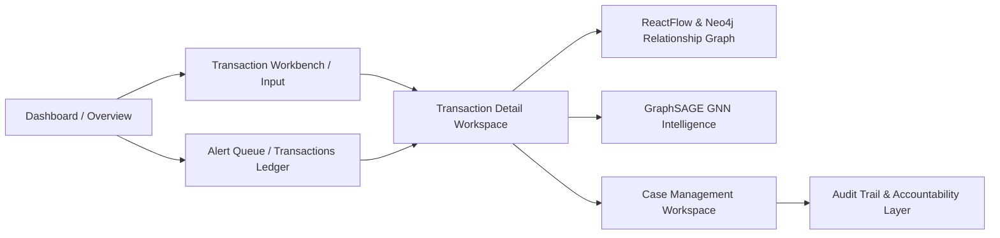
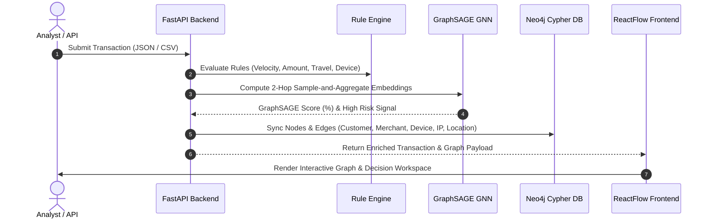

# Acentra / FraudGuard — System Overview, UI Flow, Sample Inputs & Demo Pitch Script

---

## 1. 🗺️ UI Flow & User Journey



### Screen-by-Screen Navigation

| Screen | URL Path | Core Function & Features |
| :--- | :--- | :--- |
| **Dashboard** | `/` | Operational summary, risk distribution charts, pending reviews, 30-day risk trends. |
| **Workbench / Input** | `/input` | Single transaction submission, 1-click **Run Flagged Demo Scenario**, live JSON payload preview. |
| **Transactions Ledger** | `/transactions` | Filterable transaction table, **GraphSAGE GNN score column**, expandable row drawer, JSON export. |
| **Alert Queue** | `/alerts` | High-risk & critical flagged transactions prioritized for reviewer action. |
| **Transaction Detail** | `/transactions/:id` | Full investigation workspace: rule evidence list, **GraphSAGE 2-hop GNN card**, decision buttons, printable PDF report. |
| **Graph Intelligence** | Inside Detail `/transactions/:id` | Dual-engine graph view (**ReactFlow Canvas** & **Neo4j Cypher Engine**), Circle/Card node modes, degree centrality, search & filter. |
| **Cases Page** | `/cases` | Case assignment, status updates, reviewer notes, resolution lifecycle. |
| **Audit Trail** | `/audit` | Append-only event history tracking every ingestion, configuration update, and human decision. |

---

## 2. ⚙️ System Architecture & Working Mechanism



1. **Ingestion & Validation**: Incoming transactions are validated for required attributes (amount, currency, ISO timestamp, customer ID, merchant ID, optional device/IP/coordinates).
2. **Deterministic Rule Engine**: Runs modular Python rules (*Velocity, Amount Spikes, Impossible Travel, Shared Device/IP*).
3. **GraphSAGE GNN Aggregator**: Samples 1-hop and 2-hop connected graph neighbors, computes 16-dimensional node embeddings, and predicts graph fraud probability.
4. **Neo4j Cypher Sync**: Merges nodes (`:Transaction`, `:Customer`, `:Merchant`, `:Device`, `:IP`, `:Location`) and relationships (`:MADE`, `:PAID_TO`, `:USES`, `:OCCURRED_AT`) into the graph database.
5. **Interactive UI**: ReactFlow renders nodes as circular vertices or forensic cards with zoom, pan, search, filter, and Cypher query inspection.

---

## 3. 🧪 Sample Inputs

### Sample A: Single Transaction Payload (JSON)
*Use this in the **Workbench** (`/input`) or via POST `/api/transactions`:*

```json
{
  "id": "TX-FRAUD-9901",
  "customer_id": "CUST-88301",
  "merchant_id": "MERCH-LUXURY-WATCHES",
  "amount": 4850.00,
  "currency": "USD",
  "timestamp": "2026-09-30T14:30:00Z",
  "device_id": "DEV-SHARED-992",
  "ip_address": "198.51.100.44",
  "latitude": 40.7128,
  "longitude": -74.0060
}
```

### Sample B: Bulk CSV Upload Format
*Use this in **Import** (`/import`):*

```csv
id,customer_id,merchant_id,amount,currency,timestamp,device_id,ip_address,latitude,longitude
TX-1001,CUST-101,MERCH-GROCERY,45.50,USD,2026-09-30T10:00:00Z,DEV-A1,203.0.113.5,13.0827,80.2707
TX-1002,CUST-101,MERCH-ELECTRONICS,1299.99,USD,2026-09-30T10:04:00Z,DEV-A1,203.0.113.5,13.0827,80.2707
TX-1003,CUST-101,MERCH-CRYPTO-EXCHANGE,7500.00,USD,2026-09-30T10:07:00Z,DEV-SHARED-992,198.51.100.44,48.8566,2.3522
```

---

## 4. 🎤 3-Minute Demo Pitch Script

### **[0:00 - 0:30] Introduction & Problem**
> *"Good morning / afternoon everyone. Modern financial fraud rarely happens in isolation. Fraudsters use shared devices, proxy IPs, velocity bursts, and compromised merchant outlets to evade traditional linear rules.*
>
> *Today, we present **Acentra / FraudGuard** — an end-to-end AI-powered Fraud Detection and Graph Intelligence platform that combines deterministic rules, **GraphSAGE 2-Hop Graph Neural Networks**, and **Neo4j Cypher Graph Database** into an intuitive analyst workspace."*

### **[0:30 - 1:15] Live Demo: Ingestion & Rule Evaluation**
> *"Let's navigate to our **Transaction Workbench**. Here, an analyst or API can submit live transactions or run our pre-built synthetic test scenario.*
>
> *When we click **'Run Flagged Demo'**, FraudGuard ingests a batch of baseline events followed by a suspicious high-amount transaction. Instantly, our deterministic rule engine flags the transaction for velocity spikes and impossible geographic travel."*

### **[1:15 - 2:00] GraphSAGE GNN & Neo4j Relationship Mapping**
> *"Now let's open the **Transaction Detail Workspace**. Scroll down to our **Graph Intelligence Map**.
>
> *Notice how FraudGuard automatically builds a multi-hop graph. Powered by **GraphSAGE**, our system samples 1-hop and 2-hop neighbor nodes — aggregating risk scores across shared devices and IP addresses.*
>
> *With our top control bar, analysts can switch between **Circle Vertices View** and **Forensic Node Cards**, toggle between **ReactFlow Canvas** and native **Neo4j Cypher Queries**, search node labels, or filter by entity types like Customers, Merchants, or Devices."*

### **[2:00 - 2:45] Reviewer Action, Case Management & Audit Trail**
> *"Once the analyst inspects the evidence, they can make an immediate operational decision: **Mark Reviewed**, **Clear Transaction**, or **Escalate to Case**.
>
> *When escalated, a formal investigation case is created. Every action, reviewer note, and configuration change is permanently saved in our append-only **Audit Trail**, ensuring total accountability and regulatory compliance."*

### **[2:45 - 3:00] Conclusion & Call to Action**
> *"In summary, Acentra bridges the gap between complex Graph Neural Networks and real-world compliance workflows — giving fraud teams instant visual clarity and actionable intelligence. Thank you!"*
