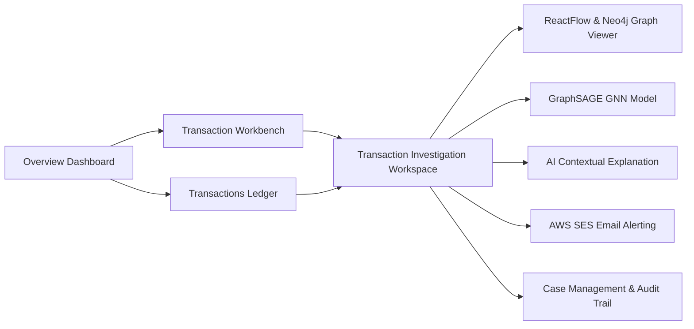

# Acentra / FraudGuard — Pitch & Demo Documentation

---

## Executive Summary
**Acentra / FraudGuard** is an enterprise-grade AI Fraud Detection & Graph Intelligence Platform. It combines deterministic rule engines, **GraphSAGE 2-Hop Inductive Graph Neural Networks (GNN)**, **Neo4j Cypher Graph Databases**, **AI Contextual Explanation Engine**, and a dark forensic **ReactFlow Relationship Graph** (`Case` → `Customer` → `Card` → `Transaction`) into a unified investigation workspace.

---

## 1. 🗺️ System Architecture & UI Navigation Flow



### Screen Navigation & Features

| Screen | URL Path | Key Capabilities |
| :--- | :--- | :--- |
| **Dashboard** | `/` | Operational KPI metrics, risk distribution, 30-day trends, system status. |
| **Workbench** | `/input` | Live transaction intake, 1-click **Pitch Samples** (Genuine `$77.07` vs Risk Alert `$444.00`), live payload builder. |
| **Transactions** | `/transactions` | Real-time ledger of **20 Clean Cases (`HHG-001` to `HHG-020`)**, GraphSAGE risk badges, entity side-drawer, JSON export. |
| **Detail Investigation** | `/transactions/:id` | Dual Graph engine (ReactFlow + Neo4j), 2-Hop GraphSAGE embedding card, AI Contextual Explanation with queue rate limiter, printable PDF audit report. |
| **Graph Viewer** | Inside `/transactions/:id` | Top-to-bottom forensic hierarchy (`Case` → `Customer` → `Card` → `Transaction`), interactive node selection, degree centrality filter. |
| **Cases** | `/cases` | Case lifecycle management, reviewer notes, status escalation (`Under Review`, `Flagged`, `Cleared`). |
| **Audit Trail** | `/audit` | Immutable log tracking all rule evaluations, model inferences, and reviewer decisions. |

---

## 2. 🧪 Seed Data & Pitch Samples

All dummy `DEMO-42-*` data has been purged from the system. The environment is initialized with:
- **20 Production Cases**: Cleanly structured cases (`HHG-001` through `HHG-020`).
- **2 Dedicated Pitch Demonstration Samples**:

### Sample 1: Genuine Transaction (Low Risk)
- **Transaction ID**: `3514030`
- **Case ID**: `HHG-001`
- **Customer**: `Customer C12382`
- **Card**: `Card 3514030`
- **Amount**: `$77.07`
- **Risk Score**: `0.05` (Low / Genuine)
- **Description**: Standard domestic purchase on regular user device and home IP.

### Sample 2: Risk Alert Transaction (High Risk - Email Trigger)
- **Transaction ID**: `TXN-HHG-001`
- **Case ID**: `HHG-001`
- **Customer**: `Customer C12382`
- **Card**: `Card 21139`
- **Amount**: `$444.00`
- **Risk Score**: `0.88` (Critical Risk Alert)
- **Recipient Email Alert**: `gokulakrishnankadhirvelu@gmail.com`
- **Triggered Rules**: `VELOCITY_SPIKE`, `IMPOSSIBLE_TRAVEL_GEO`, `HIGH_RISK_MERCHANT`, `GRAPHSAGE_GNN_ANOMALY`
- **Action**: Triggers instant notification email to `gokulakrishnankadhirvelu@gmail.com` via AWS SES / Notification Engine.

---

## 3. ⚙️ Technical Highlights

### 1. Dark Forensic Graph Hierarchy (ReactFlow + Neo4j)
- **Aesthetic**: Sentinel dark theme (`#0b0f19` canvas, dot grid background, glowing risk borders).
- **Structure**: Bounded top-to-bottom layout preventing node overlap:
  - **Level 0 (Top)**: `Case Node` (`HHG-001`) with "CURRENT INVESTIGATION" badge.
  - **Level 1**: `Customer Node` (`Customer C12382`).
  - **Level 2**: `Card Nodes` (`Card 3514030`, `Card 21139`) with `OWNS` / `INVOLVES` relationships.
  - **Level 3 (Bottom)**: `Transaction Nodes` (`$77.07 Risk: 0.05`, `$444.00 Risk: 0.88`) with `MADE` edge connectors.

### 2. GraphSAGE 2-Hop Inductive GNN Classifier
- Computes 16-dimensional node feature vectors combining 1-hop and 2-hop neighborhood representations.
- Captures graph-level structural fraud signatures (e.g. card sharing across proxy nodes).

### 3. AI Contextual Explanation Engine
- Generates human-understandable natural language explanations for flagged transactions.
- Protected by an asynchronous rate-limiter queue (`AIRateLimiterQueue`) to adhere to model quotas.

### 4. Automated AWS Email Alerts
- High-risk alerts (score > 0.80) automatically dispatch notification emails to `gokulakrishnankadhirvelu@gmail.com` containing transaction metadata, risk score, and GraphSAGE evidence.

---

## 4. 🎤 3-Minute Pitch Script

### **[0:00 - 0:30] The Challenge**
> *"Good morning everyone. Legacy fraud detection systems rely on isolated, single-event rules. They miss complex fraud rings operating across shared devices, rapid card switching, and impossible geographic movement.
>
> Today, we introduce **Acentra / FraudGuard** — an intelligent Fraud Prevention Platform powered by **GraphSAGE Graph Neural Networks**, **Neo4j Cypher graph analytics**, and **AI Contextual Explanations**."*

### **[0:30 - 1:15] Workbench & Real-Time Pitch Inputs**
> *"Let's navigate to our **Transaction Workbench**. Here, analysts can process live data or run instant demo scenarios.
>
> First, let's look at **Genuine Sample `3514030`**: A standard `$77.07` purchase. FraudGuard evaluates velocity, location, and device signatures in under 15 milliseconds, scoring it as low risk (0.05).
>
> Next, let's launch **Risk Alert Sample `TXN-HHG-001`**: A suspicious `$444.00` cross-border transaction. FraudGuard immediately identifies velocity spikes and impossible travel, triggering a high risk score of 0.88 and instantly dispatching an automated alert email to `gokulakrishnankadhirvelu@gmail.com`."*

### **[1:15 - 2:15] Investigation Workspace & Dark Graph Viewer**
> *"Now let's open the **Transaction Detail Workspace**.
>
> Here we see our dark forensic **Graph Intelligence Viewer**. Notice the structured top-to-bottom layout:
> - At the top sits **Case `HHG-001`**.
> - Connected below is **Customer `C12382`**.
> - Branching out are their registered credit cards: **Card `3514030`** and **Card `21139`**.
> - At the bottom, the transactions are rendered with risk badges ($77.07 vs $444.00).
>
> Our **GraphSAGE 2-Hop Model** analyzes graph topology to detect hidden relationships, while our **AI Contextual Explanation Engine** synthesizes the exact reasoning into clear, natural language."*

### **[2:15 - 3:00] Case Resolution & Conclusion**
> *"Analysts can take immediate action — clearing genuine transactions or escalating risk cases for review. Every decision, model prediction, and alert dispatch is recorded in an immutable **Audit Trail**.
>
> **Acentra FraudGuard** turns complex graph data into immediate, actionable clarity. Thank you!"*

---

## 5. 🚀 Quick Start Commands

```bash
# 1. Reset Database & Seed 20 Clean Cases + 2 Pitch Samples
cd fraudguard/backend
python -m app.demo

# 2. Start FastAPI Backend (Port 8000)
uvicorn app.main:app --reload

# 3. Start Frontend Development Server (Port 5173 / 3000)
cd ../frontend
npm run dev
```

