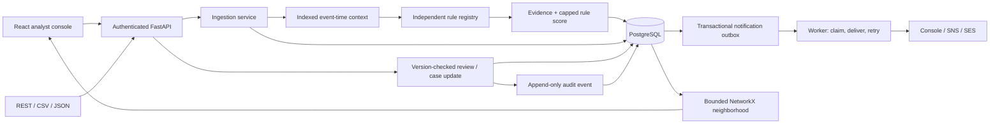

# Architecture and invariants

## Ingestion transaction boundary

1. Validate the external schema; normalize timestamps to UTC and represent money with Decimal/Numeric.
2. On PostgreSQL, acquire a transaction-scoped advisory lock derived from customer ID.
3. Reject duplicate external transaction IDs.
4. Query only already-persisted observations at or before the event timestamp.
5. Evaluate each enabled plugin. Store per-rule configuration/version/evidence. A plugin exception marks the result incomplete and flags manual review.
6. Flush the transaction, assessment, audit event, and any high-risk outbox event.
7. Commit once. The independent worker can only see committed outbox rows.

The assessment is stored as a separate relational row; individual rule results are JSON snapshots within it. This favors evidence replay in the initial release. Frequently queried per-rule aggregates could later use normalized result tables or PostgreSQL JSON indexes.

## Review invariants

- API actions require an authenticated reviewer or administrator.
- Ingestion, imports, simulation, and rule edits require administrator access.
- Requests include the version seen by the client; SQLAlchemy also enforces optimistic version checks on writes.
- A final clear/fraud decision cannot be silently overwritten through the API.
- Review state and the explanatory audit record commit together.
- Escalation creates at most one case per transaction, enforced by a unique constraint.
- Imported ground-truth labels are distinct from review status/audit feedback.
- API audit records cannot be updated or deleted through public routes. Database administrative privileges remain outside that guarantee.

## Notification invariants

- One outbox event per ingested high-risk transaction; a unique transaction foreign key prevents duplicate scheduling.
- PostgreSQL workers use row locks with `SKIP LOCKED`, holding the claim through provider acceptance and status commit.
- Network failures yield retry state, attempt count, failure type, and next eligible time.
- Five failed attempts produce a retained FAILED record, not silent loss.
- Console mode is LOCAL_LOGGED. SENT requires an AWS message ID response.
- External delivery is at least once; crash ambiguity means recipients should deduplicate by event ID.

## Temporal and analytical boundaries

The engine uses event-time cutoffs with ingestion-order tie handling. Existing assessments are immutable snapshots; later backdated data does not rewrite them. Temporal backtesting and late-event revisions need a dedicated replay pipeline.

Shared-device distinct-customer counts are queried from committed history. Different customers are not serialized on the same device, so concurrent first use can observe different snapshots. This is explicitly a bounded risk signal, not a globally consistent fraud-ring verdict.

Graph extraction filters candidate transactions by the root event time and limits the neighborhood. Node selection and edges show stored identifiers/relations only. No inferred location, synthetic fraud probability, or model output is added.

## Technology choices

FastAPI / Pydantic / SQLAlchemy / Alembic / psycopg / PostgreSQL; Argon2 / JWT; NetworkX; React / TypeScript / Vite / TanStack Query / React Router / Recharts / Cytoscape; custom responsive CSS; boto3; pytest and Playwright.

Dependency lockfiles make the installed versions reproducible. Redis, Celery, PyTorch, and cloud graph databases are not required by this core release. The system remains runnable without cloud credentials or a trained model.
